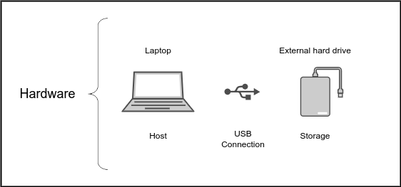
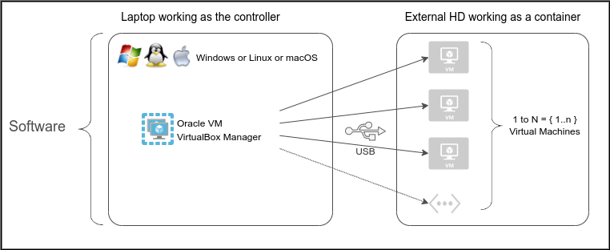
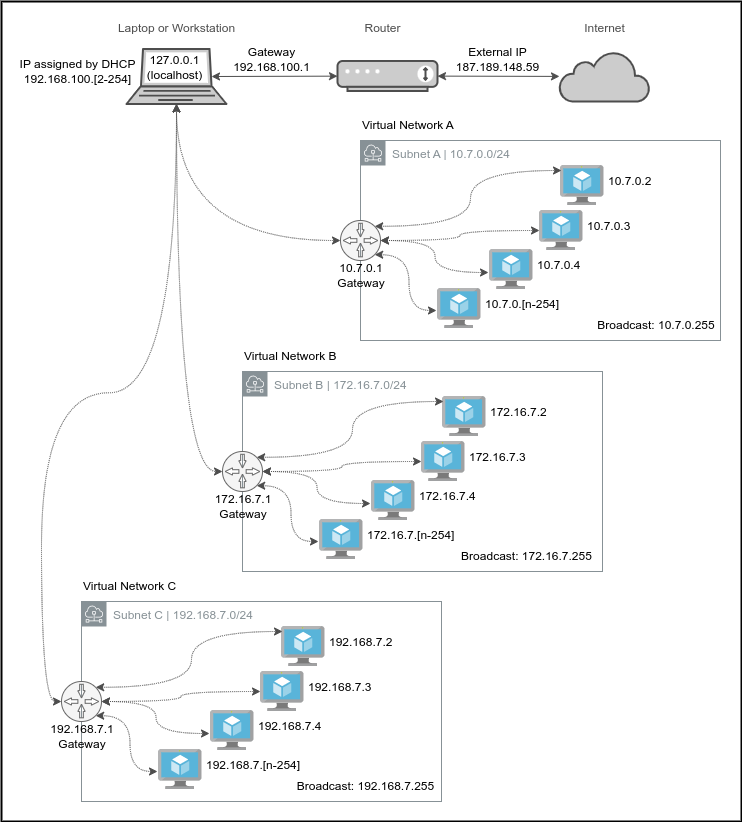
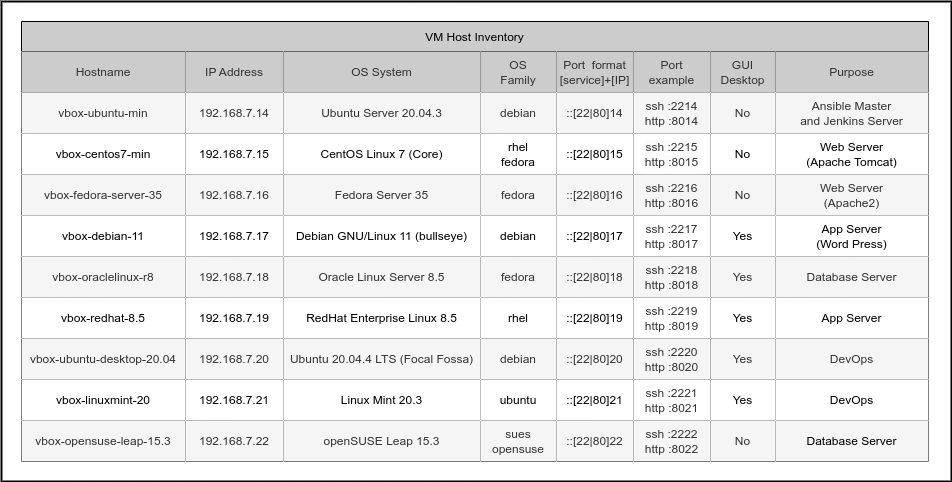

# :book: Build a home laboratory with VirtualBox

Author: [Antonio Salazar Gomez](mailto:antonio.salazar@ymail.com). 

**Document log**
|Date|Description|
|:--:|--|
|2022-01-07|Inicial creation.|

# Description

This document shows an example of building a home laboratory capable of connecting at least two virtual machines in the same virtual network.

# Work Summary

- Use your laptop, personal computer, or workstation as a host.
- Plug a USB external Hard Drive onto the laptop as storage. Use your host's disk if it has enough space.
- Choose [Oracle VM VirtualBox Manager](https://www.virtualbox.org) software to install and set up the virtual machines.
- Set up as many virtual machines (VM) as you want with VirtualBox. Preferably install Linux-based Operating Systems on your virtual machines.
- Create at least one virtual network in Oracle VM VirtualBox Manager to connect different virtual machines.
- Set up the network port forwarding to connect your host with your virtual machine. This task may need to set up a static IP address on the virtual machine.
- Ensure the VM firewall has opened the required ports to connect the host with the VM.

# Requisites
- Install [Oracle VM VirtualBox Manager](https://www.virtualbox.org/manual/UserManual.html#intro-installing) on your laptop, personal computer, or workstation.

# :bookmark_tabs: Table of Contents

- [:book: Build a home laboratory with VirtualBox](#book-build-a-home-laboratory-with-virtualbox)
- [Description](#description)
- [Work Summary](#work-summary)
- [Requisites](#requisites)
- [:bookmark\_tabs: Table of Contents](#bookmark_tabs-table-of-contents)
- [Lab blueprint](#lab-blueprint)
	- [Hardware](#hardware)
	- [Software](#software)
	- [Network](#network)
		- [Internet Service Provider (ISP) connection](#internet-service-provider-isp-connection)
		- [Host subnet(s)](#host-subnets)
		- [Commands to get the IP addresses](#commands-to-get-the-ip-addresses)
	- [Port forwarding rules](#port-forwarding-rules)
	- [Virtual machine inventory](#virtual-machine-inventory)
- [Build the laboratory](#build-the-laboratory)
	- [Step Details](#step-details)
- [:books: References](#books-references)

 

# Lab blueprint

## Hardware

The laptop works as the host, whereas the USB external Hard Drive acts as the storage, as shown in figure 1.

||
|:--:|
|Fig.1 - Lab Hardware|

_However, any configuration with enough resources to host at least two virtual machines works very well._

 

## Software

The host can run on Windows, Linux, or macOS platforms. On top of it, the Oracle VM VirtualBox Manager software serves as the VM controller.

||
|:--:|
|Fig.2 - Lab Software|

 

## Network 

The objective is to have your host connected to the Internet, and create a virtual network to connect the virtual machines. 

For that purpose use any IP private ranges, preferably class C type. 

The examples in this document use 28 _(0.0.0.0/24)_ private IP private ranges.

_0.0.0.0 IP address means all the possible IP values._

### Internet Service Provider (ISP) connection

As shown by the Figure 3:
- The router is connected to the ISP Network. 
- The router creates a subnet and assigns a private IP address to the host. _(In this example the router creates a subnet with a CIDR block of 192.168.100.0/24, with a gateway IP address of 192.168.100.1)_
- The IP address assigned to the host gets done by the [Dynamic Host Configuration Protocol (DHCP)](https://learn.microsoft.com/en-us/windows-server/networking/technologies/dhcp/dhcp-top).
- For that reason, the host IP address can take any value between the range of 192.168.100.2 and 192.168.100.254

> When hiring an ISP service, the provider configures the router for you. They usually give you the Wifi password so that you plug in your devices easily.

### Host subnet(s)

- The virtual networks are created with Oracle VM VirtualBox Manager software.
- The host virtual network could have any of the Private IP addresses below:
	- 10.0.0.0
	- 172.16.0.0
	- 192.168.0.0
- For a home lab, it is recommended to use a Class C type network because it has such a few devices connected. As a result, the CIDR block should take any values between 24 (0.0.0.0/28) and 28 (0.0.0.0/24).
- In the following diagram, three virtual networks are created with Oracle VM VirtualBox Manager. The virtual networks are using the private IP ranges and CIDR blocks below:
	- Virtual Network A: 10.7.0.0/24
	- Virtual Network B: 172.16.7.0/24
	- Virtual Network C: 192.168.7.0/24

||
|:--:|
|Fig.3 - Lab Network|

### Commands to get the IP addresses

On a terminal session run the commands below to get the public and private IP addresses:

- Public IP address: `curl ifconfig.me`
- Private IP address 
	- On Linux `ip -4 a`
	- On macOS `ifconfig  -a | grep -E "inet ([0-9]{1,3}.){1,3}"`
  - On Windows `ipconfig`

 

## Port forwarding rules

A helpful method to connect the host to the VM is the port forwarding rules.

The port forwarding allows mapping the local host IP address 127.0.0.1 to the VM IP address using a defined port number.

The Oracle VM VirtualBox Manager allows to set up of the port forwarding rules for each virtual network.

Figure 4 table shows an example of the VM Host Inventory.

|Name|Protocol|Host IP|Host Port|Guest IP|Guest Port|
|:--|:--|:--:|:--|:--:|:--|
|http_vm1|TCP|127.0.0.1|8014|192.168.7.14|8080|
|http_vm2|TCP|127.0.0.1|8015|192.168.7.15|8080|
|http_vm3|TCP|127.0.0.1|8016|192.168.7.16|80|
|http_vm4|TCP|127.0.0.1|8017|192.168.7.17|80|
|ssh_vm1|TCP|127.0.0.1|8014|192.168.7.14|22|
|ssh_vm2|TCP|127.0.0.1|8015|192.168.7.15|22|
|ssh_vm3|TCP|127.0.0.1|8016|192.168.7.16|22|
|ssh_vm4|TCP|127.0.0.1|8017|192.168.7.17|22|
|Fig.4 - Port forwarding rules|

 

## Virtual machine inventory

Depending on the project requirements, each virtual machine could have a different Operating System, IP address, and purpose.

Therefore, it is convenient to record a VM inventory with such details.

The table below shows an example of the VM inventory.

||
|:--:|
|Fig.5 - VM host inventory example|

 

# Build the laboratory

## Step Details

1. Install Oracle VM VirtualBox Manager.

	Read the directions found at [1.5. Installing Oracle VM VirtualBox and Extension Packs](https://www.virtualbox.org/manual/UserManual.html#intro-installing) by the Oracle® VM VirtualBox® User Manual

2. Create a new virtual machine.

	Follow any of the examples below to set up a virtual machine:
	- [Create a new CentOS 7 Virtual Machine in VirtualBox](https://github.com/asgdevops/virtualization/blob/main/virtualbox/vm/centos7/README.md)
	- [Create a new Ubuntu 22.04 Virtual Machine in VirtualBox](https://github.com/asgdevops/virtualization/blob/main/virtualbox/vm/ubuntu2204/README.md)

3. Create a virtual network with Oracle VM VirtualBox Manager.

	Executee the steps found at [Create a virtual network with Oracle VM VirtualBox Manager](../virtualbox/network/README.md) to create a virtual network.

 

# :books: References
- [Classless Inter-Domain Routing](https://en.wikipedia.org/wiki/Classless_Inter-Domain_Routing)
- [Understanding CIDRs and Public vs Private IPs](https://dzone.com/articles/understanding-cidrs-classless-inter-domain-routing)
- [IP Subnet Calculator](https://www.calculator.net/ip-subnet-calculator.html)
- [Private network](https://en.wikipedia.org/wiki/Private_network)
- [Dynamic Host Configuration Protocol](https://en.wikipedia.org/wiki/Dynamic_Host_Configuration_Protocol)
- [Oracle VM VirtualBox Manager](https://www.virtualbox.org)