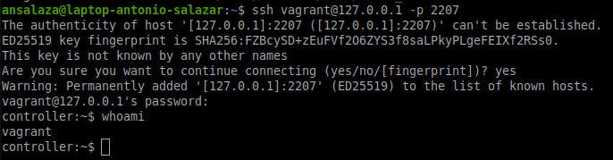
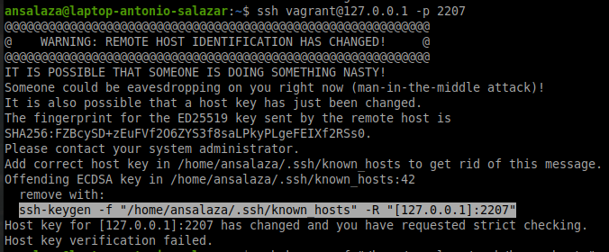
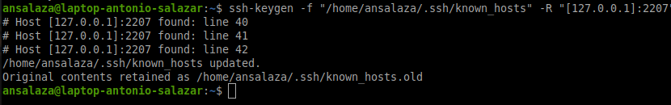

# :book: Create a VM or Cluster with Vagrant

August 2022

**Document log**
|Date|Contributor|Description|
|:--:|--|--|
|2022-09-26|[Antonio Salazar Gomez](mailto:antonio.salazar@ymail.com)|Inicial creation.|

The project's goal is to create a new Virtual Machine or three-node cluster as a playground. The cluster virtual machines are created automatically using Bash, Vagrant, and Virtual Box.

The cluster consists of a master node and two workers.

The virtual machines run Oracle Linux version 7, but they can be customizable to run any other operating system from the [vagrant boxes](https://app.vagrantup.com/boxes/search).

## Prerequisites:

- Install [Vritual Box](https://www.virtualbox.org/wiki/Documentation) on your system.

- Install [Vagrant](https://www.vagrantup.com/) on your system.
# :paw_prints: Steps

1. Choose the Vagrant [Box](https://app.vagrantup.com/boxes/search) to work with

    > _In this example the Box is based on Alpine_

2. Download the Bash script [vm.sh](vm/vm.sh) and conext files below:

    - [alpine/ssh_ports.cfg](vm/alpine/ssh_ports.cfg)
    - [alpine/Vagrantfile](vm/alpine/Vagrantfile)

3. Customize any or both above files.

4. Execute the script

    ```bash
    ./vm.sh alpine
    ```

5. Select the option you need:
   
   1. **Create** a new VM or cluster.

        This option creates three new virtual machine or VM group in Virtual Box, a master VM and two worker nodes. 

        Having the cluster created, just start or stop it when needed.

   2. **Start** an existing VM or cluster.

        When the cluster is created the virtual machines are not running, so this instruction starts up the cluster virtual machines.

   3. **Stop** the VM or cluster.

        This option stops the cluster virtual machines.

   4. **Destroy** the existing VM or cluster.

        The Destroy option removes the cluster virtual machines.

   5. **Quit** to exit menu.

<br/>

# Configuration files

## Vagrantfile
The **Vagrant* file serves as the main configuration file. In there it is possible to set up the Virtual Machine configuration such as, the VM name, IP address, Memory, CPU and so on.

- **Variables**:
    - `$VAGRANT_HOME` set the vagrant home to `$HOME/vagrant/` directory.
    - `$project` project name and context.

- **Vagrantfile** example:

    ```bash
    ENV['VAGRANT_DEFAULT_PROVIDER'] = 'virtualbox'
    ENV['VAGRANT_CWD'] = "$VAGRANT_HOME/$project"
    ENV['VAGRANT_VAGRANTFILE'] = '$VAGRANT_HOME/$project/Vagrantfile'

    # Vagrant configuration file for the entire cluster
    Vagrant.configure("2") do |config|

      # Controller or orchestrator VM  
      config.vm.define "controller" do |controller|
          controller.vm.box = "generic/alpine38"
          controller.vm.hostname = "controller"
          controller.ssh.forward_agent = true
          controller.ssh.keep_alive = true
          controller.vm.network "private_network", ip: "192.168.56.7"
          controller.vm.network "forwarded_port", guest: 22, host: 2207, host_ip: "127.0.0.1"
          controller.vm.network "forwarded_port", guest: 8080, host: 8087, host_ip: "127.0.0.1"
          controller.vm.provider :virtualbox do |v|
          v.memory = 1024
          v.cpus   = 2
          v.name   = "controller"
          v.customize ["modifyvm", :id, "--groups", "/vagrant"]
          end 
      end

        # Node1
        config.vm.define "worker1" do |worker1|
          worker1.vm.box = "generic/alpine38"
          worker1.vm.hostname = "worker-1"
          worker1.ssh.forward_agent = true
          worker1.ssh.keep_alive = true
          worker1.vm.network "private_network", ip: "192.168.56.8"
          worker1.vm.network "forwarded_port", guest: 22, host: 2208, host_ip: "127.0.0.1"
          worker1.vm.network "forwarded_port", guest: 80, host: 8088, host_ip: "127.0.0.1"
              worker1.vm.provider :virtualbox do |v|
              v.memory = 512
              v.cpus   = 1
              v.name = "vm-worker-1"
              v.customize ["modifyvm", :id, "--groups", "/vagrant"]
          end
      end

      # Node2
      config.vm.define "worker2" do |worker2|
          worker2.vm.box = "generic/alpine38"
          worker2.vm.hostname = "worker-2"
          worker2.ssh.forward_agent = true
          worker2.ssh.keep_alive = true
          worker2.vm.network "private_network", ip: "192.168.56.9"
          worker2.vm.network "forwarded_port", guest: 22, host: 2209, host_ip: "127.0.0.1"
          worker2.vm.network "forwarded_port", guest: 80, host: 8089, host_ip: "127.0.0.1"
          worker2.vm.provider :virtualbox do |v|
              v.memory = 512
              v.cpus   = 1
              v.name = "vm-worker-2"
              v.customize ["modifyvm", :id, "--groups", "/vagrant"]
          end
      end

    end 
    ```

## Vagrantfilessh_ports.cfg

It has the port list used by the VM in the cluster.
They are used to remove the records from `~/.ssh/known_hosts` after destroying the VM or VM cluster.

# Conecting to a VM 

1. Open a new terminal.
2. Issue the command `ssh vagrant@127.0.0.1 -p <port number>`

    _Accept the finger prints when prompted_

    ||
    |:--:|
    ||
    | Fig. 1 - ssh login |

3. Type the password `vagrant`

If there is an error message about another existing record on `~/.ssh/known_hosts`, remove it manually.

i.e.
```bash
ssh-keygen -f "/home/ansalaza/.ssh/known_hosts" -R "[127.0.0.1]:2207"
```

  ||
  |:--:|
  ||
  |Fig. 2 - duplicate host Key record|


  ||
  |:--:|
  ||
  |Fig. 3 - duplicate host Key record removal|

# Context examples

|Context|Config files||
|--|--|--|
|alpine|[ssh_ports.cfg](vm/alpine/ssh_ports.cfg)|[Vagrantfile](vm/alpine/Vagrantfile)|
|centos|[ssh_ports.cfg](vm/centos/ssh_ports.cfg)|[Vagrantfile](vm/centos/Vagrantfile)|
|ol7|[ssh_ports.cfg](vm/ol7/ssh_ports.cfg)|[Vagrantfile](vm/ol7/Vagrantfile)|
|ubuntu|[ssh_ports.cfg](vm/ubuntu/ssh_ports.cfg)|[Vagrantfile](vm/ubuntu/Vagrantfile)|


# :books: References
- :link: [Vagrant](https://www.vagrantup.com/) 
- :link: [Vagrant boxes](https://app.vagrantup.com/boxes/search) 