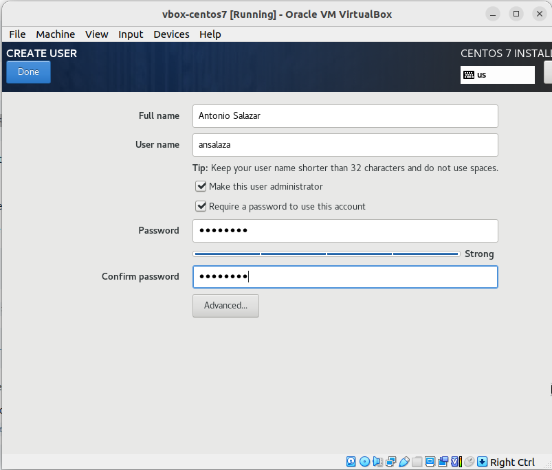

# :notes: Create a new CentOS 7 Virtual Machine in VirtualBox

By Antonio Salazar - September 2022

# :paw_prints: Steps

1. Download the `CentOS-7-x86_64-Minimal-2009.iso` from the [**CentOS downloads**](https://www.centos.org/download/) page.
2. On **VirtualBox** open the main menu and select the **Machine -> New...** option.
    
    
    
3. **Name and operating system**: Input the parameters below.
    1. **Name**: is the VM name.
    2. **Machine Folder**: the place where to save the VM configuration files, logs and disks.
    3. **Type**: select Linux as OS type.
    4. **Version**: select Red Hat (64-bit) option.
    
    
    
4. **Memory Size: s**et that to 2 GB.
    
    
    
5. **Hard disk**: Select the Create a virtual hard disk now option.
    
    
    
6. **Hard disk file type: s**elect the VDI (VirtualBox Disk Image) option.
    
    
    
7. **Storage on physical hard disk**: choose Dynamically allocated option.
    
    
    
8. **File location and size**: select the file location and 20 GB disk size. 
    
    
    
9. Once the VM is created, click on the **Properties** menu.
    
    
    
10. Open the **Storage** menu:
    1. Under Controller IDE click on the **Optical Drive**. 
    2. Pick the **CentOS-7-x86_64-Minimal-2009.iso** image file.
    3. Click **Ok**.
    
    
    
11. Open the Network menu and input the parameters below:
    1. **Enable Network Adapter**: checked.
    2. **Attached to**: Bridged Adapter.
    3. **Name**: your local PC or laptop network device name, either Wireless or Ethernet.
    4. Expand the **Advanced** option.
    5. **Cable Connected**: checked.
    6. Click **Ok**.
    
    
    
12. Click on the **Start** button.
    
    
    
13. When the VM launches, select the **Install CentOS 7** menu option.
    
    
    
14. **WELCOME TO CENTOS 7**: Select your preferred language and click **Continue**.
    
    
    
15. **INSTALLATION SUMMARY:** select the INSTALLATION DESTINATION option.
    
    
    
16. **INSTALLATION DESTINATION**: select Automatically configure partitioning and click on **Done**.
    
    
    
17. **NETWORK & HOSTNAME**: 
    1. **Ethernet (enp0s3)**: ON
    2. **Hostname**: input the name you would like to identify your VM host.
    3. **Done**.
    
    
    

15. **USER SETTINGS**: select the **ROOT PASSWORD:** menu.

1. ROOT PASSWORD: type the password for root and confirm.
    
    
    
2. CREATE USER: input the following parameters:
    1. **Full Name**: user’s full name.
    2. **User name**: host user account name.
    3. **Make this user administrator**: checked.
    4. **Require a password to user this account:** checked.
    5. **Done**.
    
    
    
3. The installation process starts, so wait until the number of packages are copied and installed.
    
    
    
4. Once the installation of CentOS 7 gets complete, click on the Reboot button. (due to the resolution of the VM, the Reboot button could be hidden or shows just a corner of it).
    
    
    
5. The process is done, the VM is started up and able to login with either the root or administrator accounts.
    
    